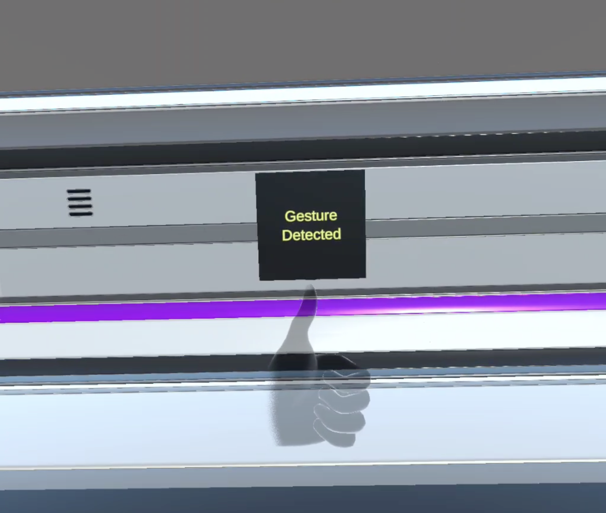

# Custom Hand Gestures

Custom Hand Gestures is a tool that enables users to record and detect static hand gestures using the Unity XRI Toolkit and Unity XR Hands. The tool utilizes wrist and fingertip data (including thumb and all four fingers) to optimize and reduce the computational load for gesture recognition. It provides position and rotation threshold values for precise gesture detection, making it a highly efficient tool for hand gesture recognition within Unity based projects.

This repository is useful for developers interested in implementing custom hand gestures in their applications, providing a smooth and accurate way to capture and identify specific hand movements.

## Features

- **Gesture Recording**: Record static hand gestures for later detection.
- **Gesture Detection**: Detects static hand gestures at runtime.
- **Optimized Recognition**: Uses wrist and fingertip data to reduce computational load.
- **Configurable Thresholds**: Set position and rotation thresholds for accurate gesture detection.
- **Unity Integration**: Seamlessly integrates with Unity projects using Unity XRI Toolkit and Unity XR Hands

## Contributing

Contributions are welcome!
